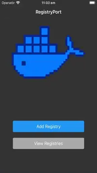
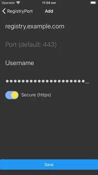
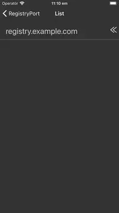
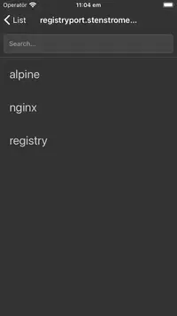
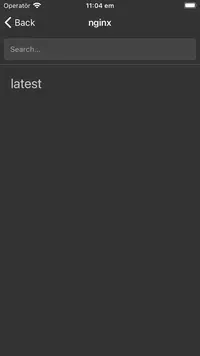
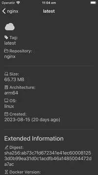

# RegistryPort


iOS app for browsing Docker registries.

## App Store Link

[](https://apps.apple.com/se/app/registryport/id6464222587)

## Screenshots

[](screenshots/one.webp) [](screenshots/two.webp) [](screenshots/three.webp) [](screenshots/four.webp) [](screenshots/five.webp) [](screenshots/six.webp)

## Development

```bash
cd ios && pod install && cd .. && npm install && npm run ios
```
